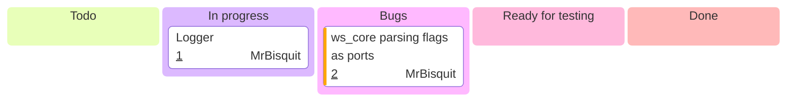

:::note
Do not assume that this page is even remotely up to date, it's better to look at individual repositories instead.
:::

## WeatherStack Core Roadmap

### 1.0.0

## WeatherStack Edge Roadmap

## WeatherStack Docs
