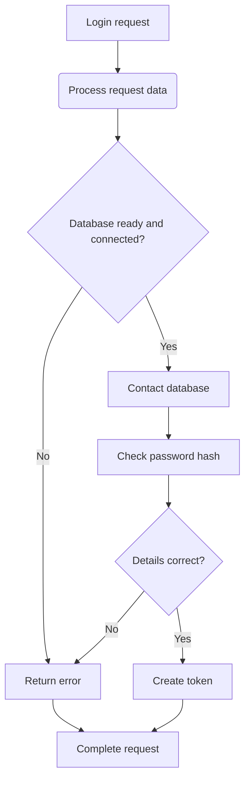

By default, any authentication tokens are created with the minimum neccecary permissions to be able to view data.
They do not by default have any power to modify configuration, make changes, or view sensitive information.

For the user to be able to perform any actions, they will need to request a temporary token upgrade. At this stage,
the user may have to reauthenticate, or enter more information, such as MFA.

These can all be configured, it is up to the front-end to manage the upgrading of tokens, and handling token
expiration.

## Service security
There are 2 main sides to the WeatherStack Core, the internal API, and the external API. The external API is secure
by default, as it follows the [security standards](/docs/standards/security/), for ease, the internal API does not
follow this by default.

It's significantly easier to configure the internal components, for things such as WeatherStack Edge, without the
default [security standards](/docs/standards/security/). However, if you have components that are outside of your
local network, so need to expose the internal API externally, you will need to set up security.
Depending on how you have WeatherStack set up, it may be as easy as pressing a button, if you use any custom
components, you will need to ensure that they follow the [security standards](/docs/standards/security/), so they
can be integrated into WeatherStack.

### API tokens
There are a few different types of API keys, such as user API keys, tokens (that are technically just API keys),
device (WeatherStack Edge) API keys for the internal API (if security is set up).

Different tokens have different properties, these 3 are the main token types.

| Property            | User API keys            | User tokens       | Device API keys                                          |
| :------------------ | :----------------------- | :---------------- | :------------------------------------------------------- |
| Lifespan            | Depends on configuration | 1 hour - 30 days* | 365 days - Forever**                                     |
| Default Permissions | Read configuration       | Read data         | Read/Write sensor data, read sensor/device configuration |

\* May be longer depending on configuration, but these are the recommended values 
\*\* Forever is recommended, but could be dangerous

## Flows

### Basic Authentication
Below is a flowchart representing the basic authentication flow for the external API.

