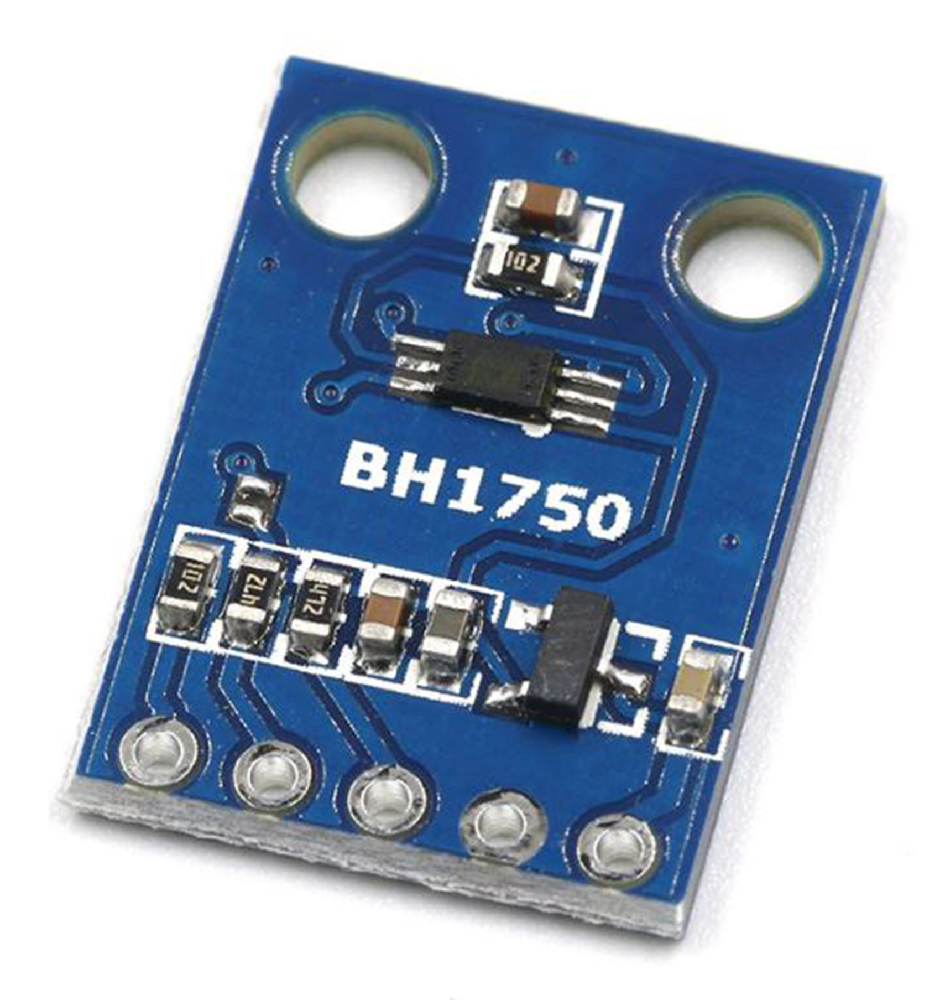

## BH1750: Ambient Light Sensor
This specifically uses the GY-302 module (**which I recommend, since it's eaiser to connect to an ESP32**), which is a breakout board for the BH1750 sensor. This sensor is used to measure ambient light levels in lux.

[View test code](https://github.com/WeatherStack/SensorTesting/blob/main/BH1750/) &bullet;
[View ESP Component](https://components.espressif.com/components/espressif/bh1750) &bullet;
[View ESP-IDF Library](/docs/components/ESP-IDF/BH1750/)

### Sensor Overview
Below are two pictures of the GY-302 BH1750 Light Intensity Module, and the Adafruit BH1750 Ambient Light Sensor. The GY-302 is a cheaper alternative to the Adafruit sensor, but both work well.
WeatherStack specifically supports the GY-302 BH1750 Light Intensity Module, but the Adafruit BH1750 Ambient Light Sensor can also be used with some minor modifications to the code.

|  |  |
| :---------------------------------------------: | :----------------------------------------------------: |
|     GY-302 BH1750 Light Intensity Module 1      |          Adafruit BH1750 Ambient Light Sensor          |

There are a few different modes that the BH1750 can operate in, which are:

| Mode                   | Precision | Measurement Time |
| :--------------------- | :-------- | :--------------- |
| Low Resolution Mode    | 4 lux     | 16 ms            |
| High Resolution Mode   | 1 lux     | 120 ms           |
| High Resolution Mode 2 | 0.5 lux   | 120 ms           |

High Resolution Mode 2 is the most accurate, but takes the longest to measure. Low Resolution Mode is the least accurate, but takes the least time to measure.
**High Resolution Mode 2 is the recommended mode to use, and the default.**

On the chip, only the `VCC`, `GND`, `SCL`, and `SDA` pins are used, which are the power, ground, and I2C data and clock pins respectively.
The `ADDR` pin is not used.