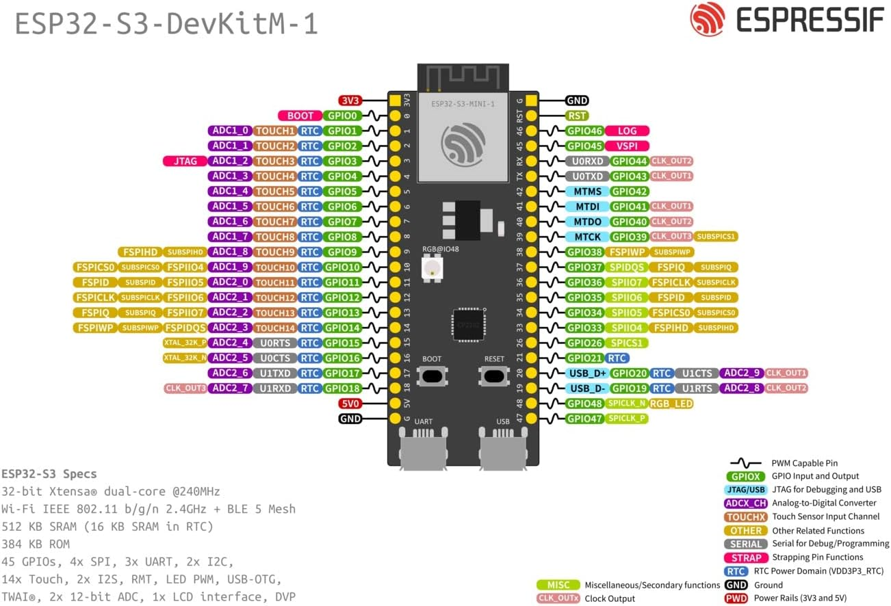
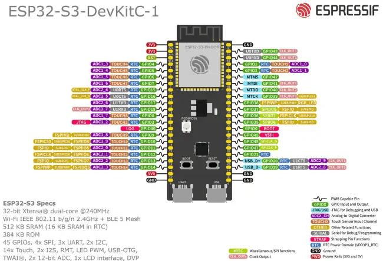

This page contains the links to all of the sensors that have been tested and implemented in WeatherStack.
If you'd like to **suggest a sensor**, please open a discussion on the GitHub Organisation.

Each of these sensors will have a component library that you will need to use to be able to use the sensor.
Most of the sensors that are marked as implemented will have a component library for both ESP-IDF **and** Arduino.
However, some many not. It is important to check.

Browse components: [ESP-IDF](/docs/components/ESP-IDF/) • [Arduino](/docs/components/Arduino/)

## Sensor implementation table meaning

The following are the possible sensor statuses:
|          | Implementation  |  Testing   | Documentation  |
| :------: | :-------------: | :--------: | :------------: |
| &#10003; |   Implemented   |   Tested   |   Documented   |
| &#8764;  |  Implementing   |  Testing   |  Documenting   |
| &#10005; | Not implemented | Not tested | Not documented |
| &#8212;  |     Unknown     |  Unknown   |    Unknown     |

## Sensor implementation table

|    Sensor name     |                      Sensor type                       |              Current Status              |                    Sensor Docs                    |
| :----------------: | :----------------------------------------------------: | :--------------------------------------: | :-----------------------------------------------: |
|      `BH1750`      |                  Ambient Light Sensor                  |  &#10005; &nbsp; &#8764; &nbsp; &#8764;  |    [View docs](/docs/supported-sensors/BH1750)    |
|      `BMP180`      |                Digital Pressure Sensor                 | &#10005; &nbsp; &#10005; &nbsp; &#10005; |    [View docs](/docs/supported-sensors/BMP180)    |
|    `CJMCU-1100`    |               Formalin Detection Sensor                | &#10005; &nbsp; &#10005; &nbsp; &#10005; |  [View docs](/docs/supported-sensors/CJMCU-1100)  |
|    `BME/BMP280`    |    Digital Temperature and Humidity Pressure Sensor    | &#10005; &nbsp; &#10005; &nbsp; &#10005; |  [View docs](/docs/supported-sensors/BME-BMP280)  |
|      `AHT10`       | High Precision Digital Temperature and Humidity Sensor | &#10005; &nbsp; &#10005; &nbsp; &#10005; |    [View docs](/docs/supported-sensors/AHT10)     |
|     `VEML7700`     |                  Ambient Light Sensor                  | &#10005; &nbsp; &#10005; &nbsp; &#10005; |   [View docs](/docs/supported-sensors/VEML7700)   |
|     `GYML8511`     |                       UV Sensor                        | &#10005; &nbsp; &#10005; &nbsp; &#10005; |   [View docs](/docs/supported-sensors/GYML8511)   |
| `ENS160` + `AHT21` |                   Air Quality Sensor                   | &#10005; &nbsp; &#10005; &nbsp; &#10005; | [View docs](/docs/supported-sensors/ENS160-AHT21) |
|     `TCS3472`      |                       RGB Sensor                       |  &#8212; &nbsp; &#8212; &nbsp; &#8212;   |                                                   |

## Pinout diagrams
These diagrams will help you when connecting your ESP32 to your sensors.

|         ESP32-S3-DevKitM-1          |
| :---------------------------------: |
|  |
|       **ESP32-S3-DevKitC-1**        |
|  |